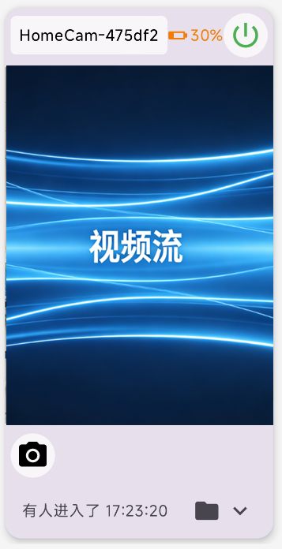

# Homecam-TE 
[HomeCam](https://github.com/lediet/HomeCam/) 监控系统的 Android 显示终端。在局域网内接收多台 HomeCam 设备的 MJPEG 视频流，支持事件监控、语音+振动报警和摄像头控制。
软件说明书见 [用户使用手册](docs/user_manual.html) - TE终端部分。
## 功能

- **多设备监控** — 最多同时显示多台 HomeCam 设备，自适应网格布局（1 台单列，2+ 台双列）
- **MJPEG/RTSP 实时流** — 每设备独立连接，支持 MJPEG 和 RTSP 双协议，9:16 竖屏比例 FIT_CENTER 显示
- **历史录像查看** - 点击文件夹图标进入历史录像页面，上半部分录像列表 + 下半部分 ExoPlayer 播放器
- **RTSP 视频流切换** - 长按菜单选择 MJPG 或 RTSP 流格式，按设备记忆选择
- **UDP 自动发现** — 局域网广播自动搜索 HomeCam 设备（单 socket + 子网定向广播）
- **事件追踪** — 轮询事件日志，增量更新，底部弹窗查看
- **语音报警** — 中文 TTS 播报事件类型（进入/离开/哭声/睡眠）
- **振动报警** — 不同事件不同振动时长
- **摄像头控制** — 电源开关（MJPEG 自动刷新）、镜头切换（全屏 + 卡片左下角）
- **设备编辑** — 长按卡片菜单编辑设备名称、IP 和端口
- **全屏预览** — 点击卡片进入全屏模式
- **设备持久化** — Room 数据库保存设备列表，启动自动恢复连接
- **主页面滚动** — 多设备时支持纵向滚动查看

## 截图


|          视频卡片页面                |
|:---------------------------------:|
|  | 

## 技术栈

| 类别 | 技术 |
|------|------|
| 语言 | Kotlin 1.9.22 |
| UI | Jetpack Compose + Material3 |
| 最低 SDK | Android 8.0 (API 26) |
| 目标 SDK | Android 14 (API 34) |
| 网络 | OkHttp 4.12.0 |
| 数据库 | Room 2.6.1 + KSP |
| JSON | Gson 2.10.1 |
| 协程 | Kotlinx Coroutines 1.7.3 |
| 视频播放 | ExoPlayer (Media3) 1.4.0 |

## 构建要求

- Android Studio Hedgehog (2023.1.1+) 或 IntelliJ IDEA
- JDK 17
- Android SDK 34

## 快速开始

1. 安装 APK 到 Android 设备
2. 启动应用，授予网络权限
3. 点击右上角 `+` 手动添加摄像头（IP + 端口）
4. 或点击搜索图标自动发现局域网内的 HomeCam 设备
5. 连接成功后自动显示视频画面

### 手动添加

- **IP 地址**：HomeCam 设备在局域网中的 IP
- **端口**：HomeCam Web 服务端口（默认 8080）
- **名称**：可选，方便识别

## API 依赖

Homecam-TE 依赖 HomeCam 服务器端提供的 REST API：

| 端点 | 用途 |
|------|------|
| `GET /video` | MJPEG 实时视频流 |
| `GET /api/events` | 事件历史记录 |
| `GET /api/cameras` | 可用摄像头列表（`{"cameras":[...]}`） |
| `GET /api/camera/switch` | 切换摄像头镜头 |
| `GET /api/camera/power` | 控制摄像头电源 |


## 项目结构

```
com.homecam.te/
├── HomeCamApp.kt           # Application 类
├── data/                   # 数据层
│   ├── CameraDatabase.kt   # Room 数据库
│   └── CameraRepository.kt # 连接管理器
├── network/                # 网络层
│   ├── ApiClient.kt        # REST 客户端
│   ├── MjpegClient.kt      # MJPEG 流解析
│   ├── EventPoller.kt      # 事件轮询
│   └── DiscoveryService.kt # UDP 发现
├── service/                # 服务层
│   └── AlertManager.kt     # 报警管理
├── model/                  # 数据模型
│   └── Models.kt
└── ui/                     # UI 层
    ├── MainViewModel.kt    # ViewModel 协调器
    ├── TEGridScreen.kt     # 主网格屏幕
    ├── CameraCard.kt       # 摄像头卡片
    ├── MjpegView.kt        # MJPEG 渲染组件
    ├── RtspView.kt         # RTSP 渲染组件（ExoPlayer）
    ├── VideoPlayerView.kt  # MP4 播放器（ExoPlayer）
    ├── VideoHistoryScreen.kt # 历史录像页面
    ├── EventSheet.kt       # 事件弹窗
    ├── AddCameraDialog.kt  # 添加对话框
├── EditCameraDialog.kt # 编辑对话框
    ├── SettingsScreen.kt   # 设置页面
    └── theme/Theme.kt      # 主题
```

## 许可证

[MIT License](LICENSE)

---

**免责声明**：本应用仅供个人安防监控使用。请遵守当地法律法规，未经他人同意不得用于偷拍等非法用途。
